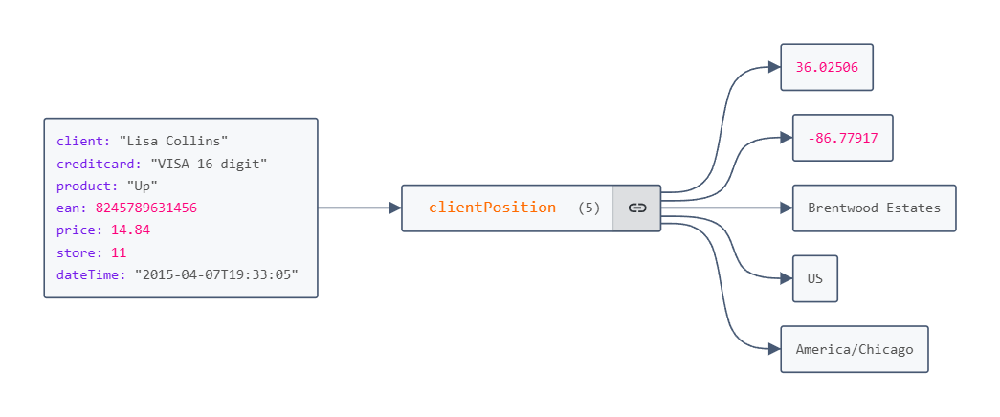

<h1 align="center">Projeto API</h1>

### Objetivo

Este projeto utiliza FastAPI para gerar dados fake e exportá-los para um arquivo .json. A API permite especificar a quantidade de dados a ser gerada, que pode ser configurada através de parâmetros na URL

### Funcionalidade

A API expõe o endpoint:

http://127.0.0.1:8000/gerar_compras/{quantidade}

Onde {quantidade} é o número de dados a ser gerado. Por exemplo, se você deseja gerar 5 registros de compras fake, basta acessar a seguinte URL:

http://127.0.0.1:8000/gerar_compras/5

A resposta será um arquivo .json contendo os dados gerados, pronto para ser utilizado em testes ou simulações.

### Dependências
                
                * Pandas 2.2.3
                * Faker 33.3.1
                * Fastapi 0.115.6
                * Requests 2.32.3

### Como usar

Instale as dependências com o poetry para isolar as mesmas no seu ambiente virtual

poetry install

Com o Poetry, execute o serviço com o seguinte comando:

poetry run uvicorn src.api:app --reload

Após, você pode ir para o seu browser e verificar ou executar o comando abaixo para obter os dados de exemplo.

curl http://127.0.0.1:8000/gerar_compras/10

### Conclusão

Este projeto foi desenvolvido com o objetivo de criar uma API simples e funcional que permita a geração de dados fake e sua exportação para arquivos .json. Ele exemplifica uma abordagem prática para consumir APIs de forma eficiente, utilizando parâmetros para personalizar os resultados de acordo com as necessidades do usuário.

A simplicidade do projeto demonstra como tecnologias como FastAPI, combinadas com ferramentas de gerenciamento como o Poetry, podem ser utilizadas para prototipar e testar aplicações de maneira ágil e eficaz. Além disso, o projeto serve como base para ampliar o conhecimento sobre a integração de APIs em fluxos reais de trabalho.

Se você está buscando uma solução compacta para gerar e consumir dados simulados, este projeto é uma excelente referência inicial.
